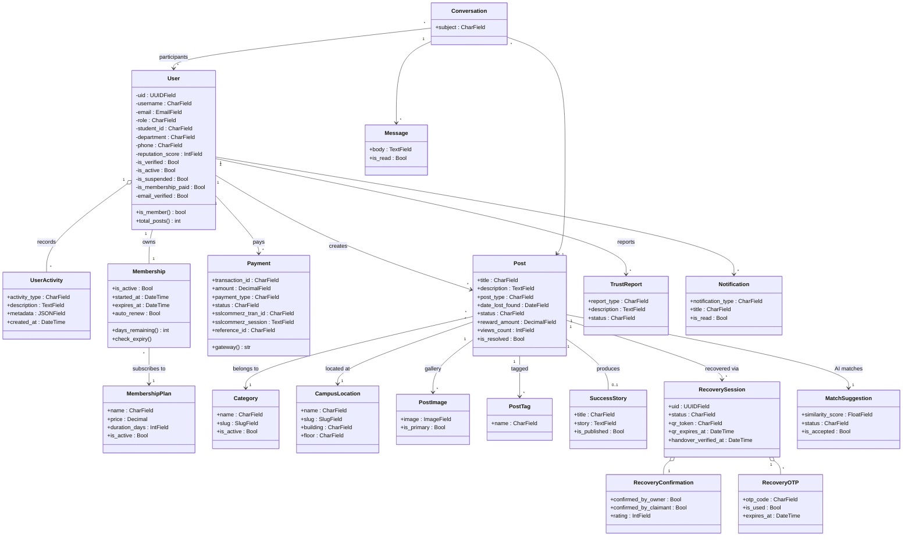
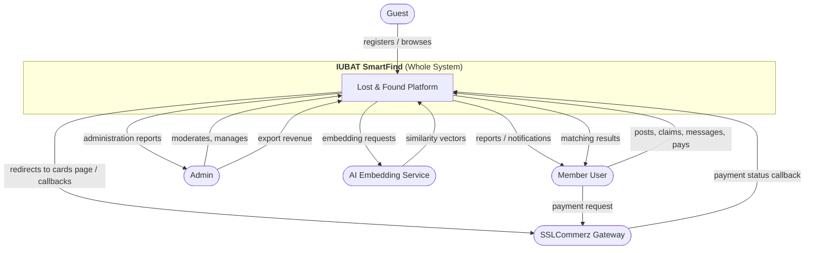
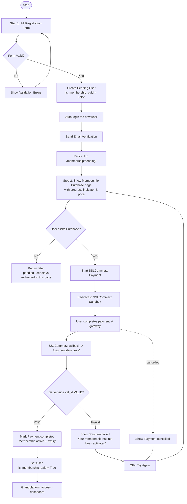

# IUBAT SmartFind — Lost & Found Platform
## 7 Diagrams (Mermaid)

> How to render: paste each code block into **https://mermaid.live**, or open this file on GitHub / VS Code (Markdown Preview Mermaid Support).

---

# 1. USE CASE DIAGRAM

```mermaid
graph LR
    %% Actors
    Guest((Guest))
    Member((Registered User))
    Admin((Admin))
    SComz([SSLCommerz Gateway])
    AIEngine([AI Matching Engine])
    EmailSvc([Email Service])

    %% Use cases - Shared
    UC1(Register Account)
    UC2(Login / Logout)
    UC3(Membership Payment & Activation)
    UC4(Browse Lost / Found Items)
    UC5(Filter & Search Items)
    UC6(Create Lost Post)
    UC7(Create Found Post)
    UC8(View Item Details)
    UC9(Claim / Initiate Recovery)
    UC10(Scan QR & Verify Handover)
    UC11(Direct Messaging / Chat)
    UC12(Manage Profile & Settings)
    UC13(AI Smart Search & Match Suggestions)
    UC14(Receive Notifications)

    %% Guest access
    Guest --> UC1
    Guest --> UC4
    Guest --> UC5

    %% Member access
    Member --> UC2
    Member --> UC3
    Member --> UC6
    Member --> UC7
    Member --> UC8
    Member --> UC9
    Member --> UC10
    Member --> UC11
    Member --> UC12
    Member --> UC13
    Member --> UC14

    %% Include relationships
    UC4 -.-> UC5 : <<include>>
    UC9 -.-> UC2 : <<include>>
    UC10 -.-> UC2 : <<include>>

    %% Admin use cases
    Admin --> UC2
    Admin --> A1[Manage Users & Membership]
    Admin --> A2[Moderate & Manage Posts]
    Admin --> A3[Revenue & Payment History]
    Admin --> A4[Manage Trust Reports]
    Admin --> A5[Manage Categories & Locations]

    %% External actors
    Member --> UC3
    UC3 -->|payment session / callback| SComz
    Member --> UC13
    UC13 --> AIEngine
    AIEngine -->|match suggestions & search results| Member
    Guest --> UC1
    UC1 --> EmailSvc
```

---

# 2. CLASS DIAGRAM



---

# 3. ER DIAGRAM

```mermaid
erDiagram
    USER ||--o{ USER_ACTIVITY : "generates"
    USER ||--o| MEMBERSHIP : "has"
    USER ||--o{ PAYMENT : "makes"
    USER ||--o{ POST : "creates"
    USER ||--o{ CONVERSATION : "participates in"
    USER ||--o{ NOTIFICATION : "receives"
    USER ||--o{ TRUST_REPORT : "reports"
    USER ||--o{ MESSAGE : "sends"
    USER ||--o{ RECOVERY_SESSION : "claims"
    USER ||--o{ RECOVERY_VERIFICATION_LOG : "performs"

    MEMBERSHIPPLAN ||--o{ MEMBERSHIP : "defines"

    CATEGORY ||--o{ POST : "categorizes"
    CAMPUS_LOCATION ||--o{ POST : "places"

    POST ||--o{ POST_IMAGE : "has"
    POST ||--o{ POST_TAG : "has"
    POST ||--o| SUCCESS_STORY : "produces"
    POST ||--o| POST_EMBEDDING : "has embedding"
    POST ||--o{ MATCH_SUGGESTION : "suggests matches"
    POST ||--o{ RECOVERY_SESSION : "recovered via"
    POST ||--o{ TRUST_REPORT : "reported for"
    POST ||--o{ CONVERSATION : "sourced from"
    POST ||--o{ POST : "matched with"

    CONVERSATION ||--o{ MESSAGE : "contains"
    CONVERSATION }o--|| USER : "has participants"

    RECOVERY_SESSION ||--o{ RECOVERY_VERIFICATION_LOG : "verified by"

    USER {
        uuid uid PK
        varchar username UK
        varchar email UK
        varchar password
        varchar role "guest | student | admin"
        varchar student_id UK
        varchar department
        varchar phone
        text bio
        text address
        json social_links
        int reputation_score
        bool is_verified
        bool is_active
        bool is_suspended
        bool is_membership_paid
        bool email_verified
        varchar email_verification_token
        varchar reset_password_token
        int failed_login_attempts
        timestamp locked_until
        timestamp last_activity
    }

    USER_ACTIVITY {
        bigint id PK
        bigint user_id FK
        varchar activity_type
        text description
        json metadata
        timestamp created_at
    }

    MEMBERSHIPPLAN {
        bigint id PK
        varchar name
        decimal price
        int duration_days
        text description
        bool is_active
    }

    MEMBERSHIP {
        bigint id PK
        bigint user_id FK "OneToOne"
        bigint plan_id FK
        bool is_active
        timestamp started_at
        timestamp expires_at
    }

    PAYMENT {
        bigint id PK
        bigint user_id FK
        varchar transaction_id
        decimal amount
        varchar payment_type "membership | reward"
        varchar status "pending | processing | completed | failed | cancelled"
        text sslcommerz_session
        varchar sslcommerz_tran_id
        varchar reference_id
        json metadata
    }

    CATEGORY {
        bigint id PK
        varchar name
        varchar slug UK
        text description
        varchar icon
        bool is_active
    }

    CAMPUS_LOCATION {
        bigint id PK
        varchar name
        varchar slug UK
        text description
        varchar building
        varchar floor
        bool is_active
    }

    POST {
        bigint id PK
        bigint user_id FK
        bigint category_id FK
        bigint location_id FK
        varchar title
        text description
        varchar post_type "lost | found"
        date date_lost_found
        varchar location_name
        varchar image
        text contact_info
        varchar status "open | claimed | resolved | rejected | closed"
        bool is_resolved
        bool is_active
        int views_count
        bigint matched_post_id FK "self-ref"
    }

    POST_IMAGE {
        bigint id PK
        bigint post_id FK
        varchar image
        varchar caption
        bool is_primary
    }

    POST_TAG {
        bigint id PK
        bigint post_id FK
        varchar name
    }

    SUCCESS_STORY {
        bigint id PK
        bigint post_id FK "OneToOne"
        varchar title
        text story
        varchar finder_name
        varchar owner_name
        text finder_message
        text owner_message
        bool is_featured
        bool is_published
    }

    POST_EMBEDDING {
        bigint id PK
        bigint post_id FK "OneToOne"
        vector embedding "256 dimensions"
    }

    MATCH_SUGGESTION {
        bigint id PK
        bigint post_id FK
        bigint matched_post_id FK
        float similarity_score
        float semantic_score
        float metadata_score
        varchar match_strength "strong | possible"
        varchar status "pending | accepted | dismissed"
        bool is_viewed
        bool is_accepted
    }

    CONVERSATION {
        bigint id PK
        bigint post_id FK
        varchar subject
    }

    MESSAGE {
        bigint id PK
        bigint conversation_id FK
        bigint sender_id FK
        text body
        bool is_read
        bool is_edited
        bool is_deleted
        timestamp edited_at
        timestamp deleted_at
    }

    NOTIFICATION {
        bigint id PK
        bigint user_id FK
        varchar notification_type
        varchar title
        text message
        varchar link
        bool is_read
        timestamp read_at
    }

    TRUST_REPORT {
        bigint id PK
        bigint reporter_id FK
        bigint reported_user_id FK
        bigint post_id FK
        varchar report_type
        text description
        varchar status
        bigint reviewed_by_id FK
        text resolution_notes
    }

    RECOVERY_SESSION {
        bigint id PK
        bigint post_id FK
        bigint owner_id FK
        bigint claimant_id FK
        varchar short_code UK "e.g. LF-7K29QX"
        varchar status "pending | token_generated | token_entered | completed | expired | cancelled"
        timestamp token_verified_at
        timestamp completed_at
        timestamp expires_at
        text notes
    }

    RECOVERY_VERIFICATION_LOG {
        bigint id PK
        bigint session_id FK
        varchar action
        bigint performed_by_id FK
        json details
        varchar ip_address
    }
```



---

# 4. DFD LEVEL 0 (CONTEXT DIAGRAM)



---

## 5. DFL LEVEL 1

```mermaid
flowchart TB
    P1[P1 Register]
    P2[P2 Authenticate / Session]
    P3[P3 Browse & Search]
    P4[P4 Create & Manage Posts]
    P5[P5 Membership Purchase]
    P6[P6 SSLCommerz Payment]
    P7[P7 Recovery / QR]
    P8[P8 Messaging]
    P9[P9 Notifications]
    P10[P10 AI Matching]
    P11[P11 Admin Manage]
    P12[P12 Reports / Trust]

    D1[(Users DB)]
    D2[(Posts DB)]
    D3[(Payments DB)]
    D4[(Recovery DB)]
    D5[(Message/Chat DB)]
    D6[(Admin/Logs DB)]

    Guest --> P1
    P1 --> D1
    Member --> P2 --> D1
    Member --> P3
    P3 --> D2
    Member --> P4
    P4 --> D2
    Member --> P5
    P5 --> P6
    P6 --> D3
    P6 --> D2  %% activate membership
    Member --> P7
    P7 --> D4
    Member --> P8
    P8 --> D5
    P9 --> D2
    P10 --> D2
    Member --> P10
    Admin --> P11
    P11 --> D2
    P11 --> D3
    Member --> P12
    P12 --> D4
    SSLCommerz(SSLCommerz) -->|callback| P6
    AI(AI Engine) -->|vectors| P10
    Admin --> D3
```

---

## 6. ACTIVITY DIAGRAM (Two-Step Registration & Membership)



---

## 7. SEQUENCE DIAGRAM (SSLCommerz Membership Payment)

```mermaid
sequenceDiagram
    participant U as Member User
    participant B as Browser / App
    participant D as Django App
    participant S as SSLCommerz sandbox
    participant DB as Database

    U->>B: Click "Purchase Membership"
    B->>D: GET /membership/purchase/&lt;plan_id&gt;/
    D->>DB: create Payment(status=pending, tran_id)
    D->>S: POST initiate_payment(store_id, amount, tran_id)
    S-->>D: SUCCESS + GatewayPageURL
    D-->>B: 302 redirect to GatewayPageURL
    B->>S: User completes payment at gateway
    U->>S: Pay (sandbox card)
    S-->>D: POST callback /payments/success/ (val_id, tran_id)
    D->>S: POST validation (val_id, store_id, pass) [IPN verify]
    S-->>D: verify status VALID
    D->>DB: UPDATE Payment -> completed + transaction_id
    D->>DB: UPDATE Membership -> active + expires_at
    D->>DB: UPDATE User -> is_membership_paid=True
    D-->>B: redirect /membership/success/
    B-->>U: show success page -> "Go to Dashboard"
```

---

# Bonus / Legend

- **Mermaid note:** DFL = Data-Flow Diagram. For DFD boxes use plain Mermaid flowcharts; some boxes typed as labels only for readability. Adjust labels to match your report if exports are needed.
- Diagrams map 1:1 to models found in `apps/*/models.py` and flows in `apps/payments/views.py`, `apps/membership/views.py`, `apps/accounts/views.py`.